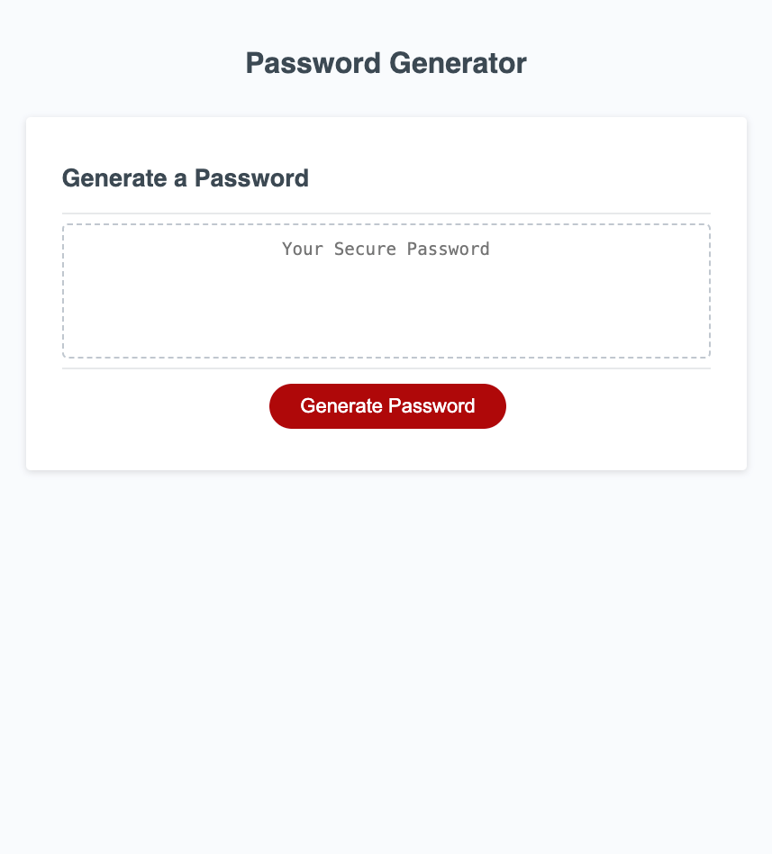

# Module-3-Challenge

## Description

This project aims to generate a passsword after a prompt is answered and confirms. The password will include specified characters and length can be decided within certain limits. 

## Installation

N/A

## Usage

To generate a random password that will be strong and usable. 

## Deployment
https://joshrthedeveloper.github.io/Module-3/

#### Screenshot

.

## Credits

Reset style is provided by http://meyerweb.com/eric/tools/css/reset/ 

## License

Please refer to the MIT LICENSE in the repo.
